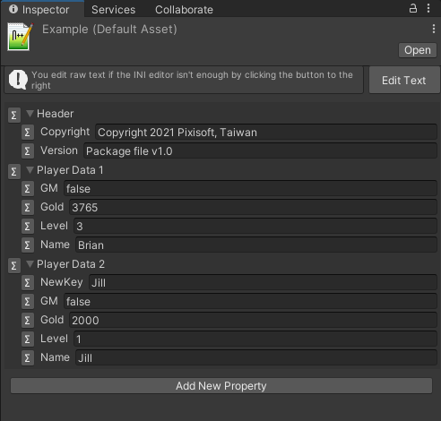
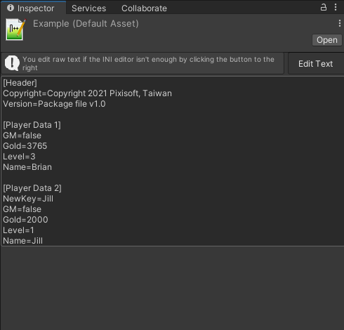

# Inspect Ini

A dedicated and up to date INI editor inside the Inspector window.

| GUI Mode                       | Text Mode                      |
|:-------------------------------|:-------------------------------|
|  |  |

*P.S. This package requires [ini-parser](https://github.com/rickyah/ini-parser) to run, yet we have included for you!*

## 📁 Project Structures

> 
> 

* `Source` - Project contains plugin's source code.
* `Compile` - Project compiles source to DLL, it will link `_references` DLLs.
* `_references` - Unity DLL to compile project source to DLL.

> 
> 

* `Publish` - Project that contains package DLL and ready to publish to [Asset Store Publisher](https://publisher.assetstore.unity3d.com/info.html?_gl=1*1fwg1ij*_ga*MTg0NjU4MTc4NC4xNjAwMzQ5NzM3*_ga_1S78EFL1W5*MTYyNDI3MzU4Ni40Ni4wLjE2MjQyNzM1ODYuNjA.&_ga=2.77544981.1416380940.1624186429-1846581784.1600349737) portal.

## 🏆 Features

* Out of box
* Lightweight and easy to use
* Fully compatible with Unity system
* Fully accessible to source code

## License

Copyright (c) Pixisoft. All rights reserved.

Licensed under MIT. See [LICENSE.txt](https://github.com/Pixisoft/Inspect_Ini/blob/master/LICENSE.txt) for details.
