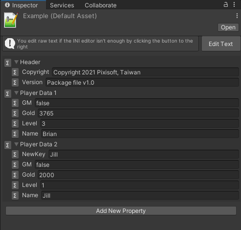
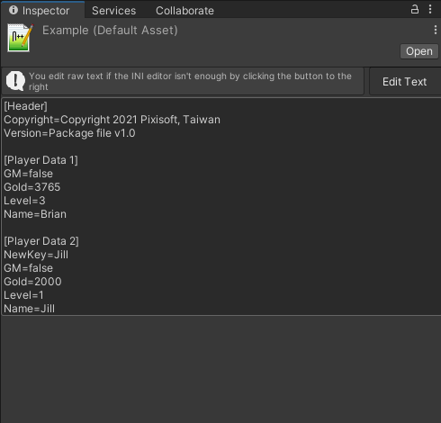

# Inspect Ini

A dedicated and up to date INI editor inside the Inspector window.

| GUI Mode                       | Text Mode                      |
|:-------------------------------|:-------------------------------|
|  |  |

*P.S. This package requires [ini-parser](https://github.com/rickyah/ini-parser) to run, yet we have included for you!*

## :trophy: Features

* Out of box
* Lightweight and easy to use
* Fully compatible with Unity system
* Fully accessible to source code

## License

Copyright (c) Pixisoft. All rights reserved.

Licensed under MIT. See [LICENSE.txt](https://github.com/Pixisoft/Inspect_Ini/blob/master/LICENSE.txt) for details.
